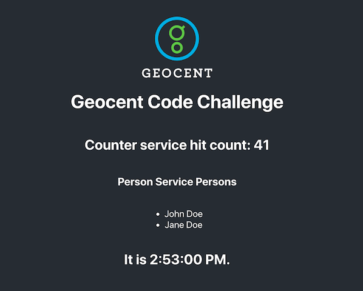

# Sev1Tech DevOps Code Challenge

## The Challenge

#### Part 1
The development teams on your project have been working on a set of microservices. They need help getting the docker containers build and running.

#### Part 2
In addition, the team would like to use Kubernetes to deploy these services in continuous integration and production environments. Because `Docker for Mac` and `Docker for Windows` provides Kubernetes out-of-the-box, the team would like to be able to test their services locally in Kubernetes before progressing to CI pipelines. Your goal is to prepare Kubernetes configuration in order to deploy the services in a local Kubernetes cluster.



## Pre-Requisites
- `docker`, `docker-compose`,
- `kubectl`
- `k3d` https://k3d.io/
- `helm`
- `git` and `github` account

## Provided Architecture
<pre>																			  
Web Browser Client -->  webapp --> person-service --> postgres
</pre>

## Service Details
- `postgres` - Postgres database used by the `person-service`
	- Base Docker hub image tag: `postgres:11`
	- Exposed port: `5432`
- `person-service` - A spring-boot/Java backend microservice that provides `persons` REST endpoints
	- Base Docker hub image tags: `gradle:5.4-jdk11` and `openjdk:11.0-jdk` (Use multi-stage Dockerfiles)
	- Exposed port: `8080`
- `webapp` - React SPA frontend that consumes the `person-service` and `counter-service`
	- Base Docker hub image tags: `node:12-alpine` and `nginx:1.14.2` (Use multi-stage Dockerfiles)
	- Exposed port: `8000` and/or `80`

## Steps
- build the docker images. Ensure they run
- standup a Kubernetes cluster using `k3d`
```
k3d cluster create mycluster
```
- deploy the solution to Kubernetes using `helm`
